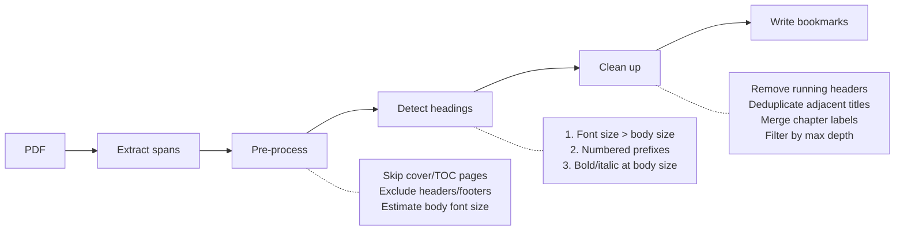

<p align="center">
  
</p>

<h1 align="center">bmrk</h1>

<p align="center">
  A simple CLI tool for adding structured bookmarks to PDFs.
</p>

<p align="center">
  <a href="https://github.com/AnvarAtayev/bmrk/actions/workflows/ci.yml">
    
  </a>
  <a href="https://pypi.org/project/bmrk/">
    
  </a>
  <a href="https://pypi.org/project/bmrk/">
    
  </a>
  <a href="https://opensource.org/licenses/MIT">
    
  </a>
</p>

`bmrk` analyses a PDF's text and font metadata to detect its heading structure, then writes a bookmarked copy for easier navigation in any PDF viewer.

---

### Table of Contents
- [Installation](#installation)
  - [From source](#from-source)
  - [With OCR support](#with-ocr-support)
    - [OCR in a dev environment](#ocr-in-a-dev-environment)
- [Usage](#usage)
  - [Basic](#basic)
  - [Options](#options)
  - [Inspect before writing](#inspect-before-writing)
  - [Manual heading adjustments](#manual-heading-adjustments)
  - [Tune for a noisy PDF](#tune-for-a-noisy-pdf)
  - [Handle a cover page](#handle-a-cover-page)
- [How it works](#how-it-works)
- [Code structure](#code-structure)
- [Limitations](#limitations)
- [Development](#development)
- [Contributing](#contributing)
- [License](#license)

---
## Installation

```bash
pip install bmrk
```

For an isolated install that keeps `bmrk` available globally without polluting your Python environment:

```bash
# pipx
pipx install bmrk

# uv
uv tool install bmrk
```

To run `bmrk` once without installing it:

```bash
# pipx
pipx run bmrk paper.pdf paper_bookmarked.pdf

# uvx (uv's ephemeral tool runner)
uvx bmrk paper.pdf paper_bookmarked.pdf
```

### From source

```bash
pip install git+https://github.com/AnvarAtayev/bmrk.git
```

### With OCR support

For scanned PDFs that lack a text layer, install the optional OCR extra:

```bash
pip install "bmrk[ocr]"
# or
pipx install "bmrk[ocr]"
# or
uv tool install "bmrk[ocr]"
```

This pulls in [ocrmypdf](https://ocrmypdf.readthedocs.io/), which itself requires **Tesseract** and **Ghostscript** to be installed on your system:

```bash
# macOS
brew install tesseract ghostscript

# Debian/Ubuntu
sudo apt install tesseract-ocr ghostscript

# Windows -- download installers from:
#   https://github.com/UB-Mannheim/tesseract/wiki
#   https://www.ghostscript.com/releases/gsdnld.html
```

Then pass `--ocr` to `bmrk`:

```bash
bmrk scanned.pdf scanned_bookmarked.pdf --ocr
```

#### OCR in a dev environment

```bash
# 1. Clone the repo and sync all extras
git clone https://github.com/AnvarAtayev/bmrk.git
cd bmrk
uv sync --extra dev --extra ocr

# 2. Install system deps (macOS example)
brew install tesseract ghostscript

# 3. Run
uv run bmrk scanned.pdf out.pdf --ocr
```

## Usage

```
bmrk [OPTIONS] <INPUT>.pdf [<OUTPUT>.pdf]
```

### Basic

```bash
bmrk paper.pdf paper_bookmarked.pdf
```

### Options

| Flag | Default | Description |
|------|---------|-------------|
| `--threshold RATIO` / `-t` | `1.05` | Font-size ratio above which text is treated as a heading. Raise to `1.15` for noisy PDFs; lower to `1.01` to catch bold same-size section titles. |
| `--verbose` / `-v` | off | Print detected headings and progress info. |
| `--dry-run` / `-n` | off | Detect and print headings only; do not write an output file. Useful for tuning `--threshold`. |
| `--ocr` | off | Run OCR before detection. Requires `bmrk[ocr]`. |
| `--export-headings FILE` | -- | Write detected heading structure to FILE (TSV). Edit and feed back in with `--import-headings`. |
| `--import-headings FILE` | -- | Use headings from FILE instead of running detection. Enables manual adjustments. |
| `--cover-pages N` | `0` | Skip the first N pages when detecting headings (e.g. cover page). |
| `--max-depth N` / `-d` | `3` | Maximum heading depth to include (1 = chapters only, 2 = + sections, 3 = + subsections). |

### Inspect before writing

```bash
bmrk paper.pdf --dry-run --verbose
```

### Manual heading adjustments

If the auto-detected bookmarks are not quite right, you can export the heading structure, edit it by hand, and import the corrected version back in.

**Step 1 -- Export the detected headings**

```bash
bmrk paper.pdf --export-headings headings.tsv
```

When OUTPUT is omitted, `bmrk` runs detection and exports the heading list without writing a PDF.

**Step 2 -- Edit the TSV file**

Open `headings.tsv` in any text editor or spreadsheet app. The format is tab-separated with three columns:

```
# bmrk heading export
# level	page	title
1	1	Introduction
2	3	Background
2	7	Methods
1	12	Results
3	14	Statistical Analysis
```

- **level** -- heading depth (1 = top-level chapter, 2 = section, 3 = subsection, ...).
- **page** -- 1-based page number where the heading appears.
- **title** -- the bookmark text shown in the PDF viewer.
- Lines starting with `#` are comments and are ignored on import.

Common edits:

- **Remove a heading** -- delete the line entirely.
- **Add a missing heading** -- insert a new line with the correct level, page, and title.
- **Fix a title** -- change the text in the third column.
- **Change nesting** -- adjust the level number (e.g. change `2` to `1` to promote a section to a chapter).
- **Reorder headings** -- rearrange lines; bookmarks are inserted in the order they appear in the file.

**Step 3 -- Import and produce the bookmarked PDF**

```bash
bmrk paper.pdf paper_bookmarked.pdf --import-headings headings.tsv
```

This skips detection entirely and uses your edited headings to write the bookmarked PDF.

### Tune for a noisy PDF

```bash
# More conservative -- only large headings
bmrk paper.pdf out.pdf --threshold 1.15

# More aggressive -- catches bold same-size section titles
bmrk paper.pdf out.pdf --threshold 1.01
```

### Handle a cover page

```bash
# Skip page 1 (the cover) when detecting headings
bmrk report.pdf report_bookmarked.pdf --cover-pages 1
```

## How it works

`bmrk` reads every text span in the PDF along with its font size and style, then uses three signals to find headings:

1. **Font size** -- text larger than the body font is a heading. The biggest text becomes H1, the next size H2, and so on.
2. **Numbered prefixes** -- lines like `1  Introduction` or `2.3  Methods` are headings, with depth inferred from the numbering.
3. **Bold/italic at body size** -- some documents style section headings in bold or italic without changing the font size. These are picked up as the lowest heading level.

After detection, `bmrk` cleans up the results (removes running page headers, deduplicates, merges chapter labels like `Chapter 1` with the title that follows) and writes the final bookmark outline into the output PDF.



## Code structure

```
src/bmrk/
├── cli.py        # Typer CLI entry point
├── detector.py   # Heading detection logic and HeadingEntry dataclass
├── bookmarker.py # PDF bookmark writing
```

## Limitations

- **Scanned/image PDFs** -- `bmrk` cannot detect headings in PDFs without selectable text. Run OCR first with `bmrk --ocr` (requires `bmrk[ocr]`).
- **Existing bookmarks** -- `bmrk` replaces any existing outline; it does not merge with pre-existing bookmarks.

## Development

```bash
uv sync --extra dev

# Lint
uv run ruff check src/

# Test
uv run pytest
```

## Contributing

Contributions are welcome. Bug reports, feature requests, and pull requests can all be submitted via [GitHub Issues](https://github.com/AnvarAtayev/bmrk/issues) or as a pull request against `main`.

Before opening a pull request, run the lint and test suite to confirm nothing is broken:

```bash
uv sync --extra dev
uv run ruff check src/
uv run pytest
```

## License

MIT
